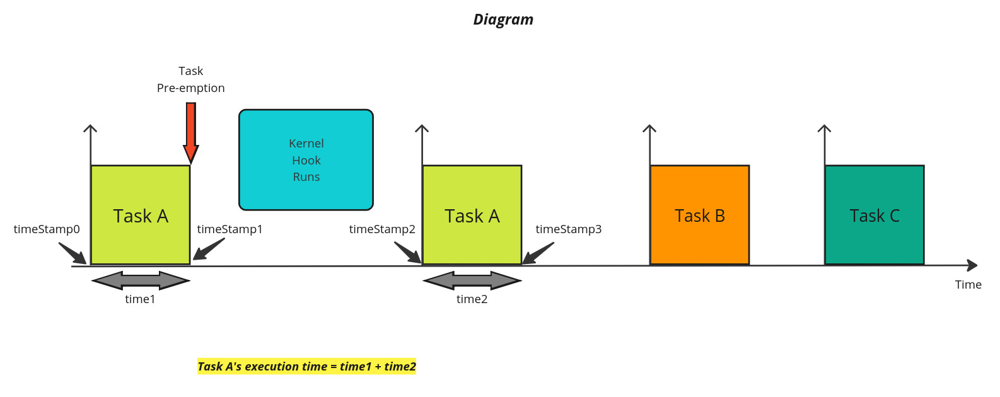

# Measuring Real-Time Tasks Execution Times in VxWorks

This project measures the execution times of Real-Time, preemptive
tasks in VxWorks. The execution times are calculated using a time
function that runs at the kernel level; the code recording the timestamps
is triggered by a context-switch hook.

Project's Implementation Diagram:

VxWorks functions are used in this code for kernel programming.

The Real-Time tasks calculate Matrix Multiplication applying different
algorithms such as nested-loops-based algorithms and Strassen's Algorithm.

The time in which a task was idle is not included in the task's execution time.

This was an academic project for a Real-Time Systems & Embedded Programming class.

This code is not in the public domain. All rights belong to the original
authors. Do not use without explicit written authorization.
